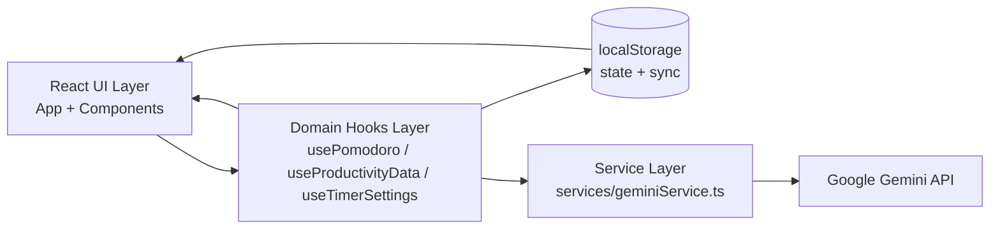
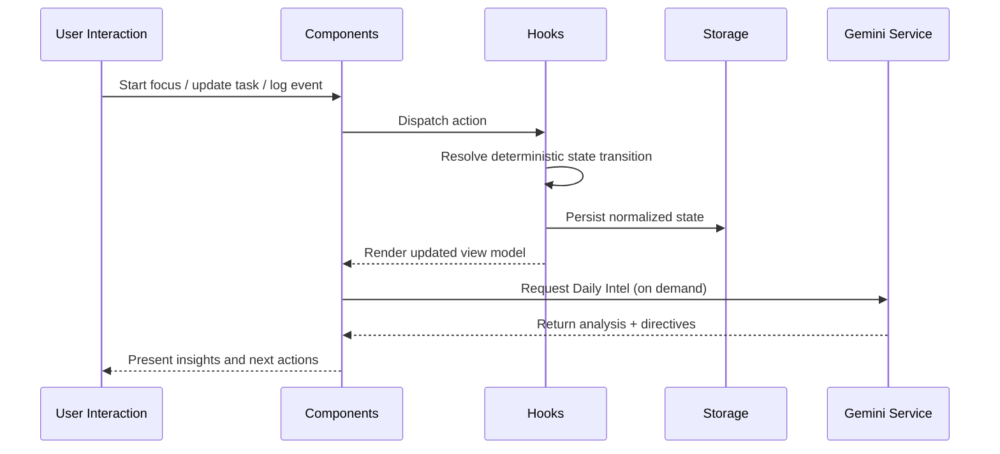

# Zenith Focus

> [!IMPORTANT]
> This is not a timer app.
> This is a neural productivity engine for deep work operators.

Zenith Focus is a React + Vite + TypeScript system that turns session telemetry into actionable behavioral intelligence.

- Deterministic focus cycles with zero-drift timing
- State-driven habit tracking with cross-tab synchronization
- AI-powered Daily Intel from structured work-session metadata
- Eisenhower task matrix + gamified progression loops

## Core Experience

Zenith Focus ships as a modular productivity cockpit:

- **Focus Runtime**: deterministic Pomodoro state machine with session lifecycle control
- **Mission Control**: task matrix, daily intel, and session log surfaces
- **Neural Analytics**: Gemini-backed interpretation of focus/break/interruption patterns
- **Adaptive UX Layer**: floating timer, pop-out timer, command palette, keyboard-first controls

## Architecture Snapshot



## Technical Deep-Dive

### Why the `/services` layer is separated from the `/hooks` layer

Separation is a scaling decision, not style preference.

| Layer | Responsibility | Scaling Benefit |
|---|---|---|
| `/hooks` | Deterministic client state orchestration, timers, local persistence, cross-tab sync | Keeps UI behavior predictable and testable with pure React contracts |
| `/services` | External I/O, model prompts, response schema handling, AI-specific transformations | Allows provider swaps, transport changes, and backend migration with minimal UI impact |

This architecture prevents a common failure mode in productivity apps: entangling UI timing logic with remote AI calls. In Zenith Focus, the clock and task state remain deterministic even when network or model availability degrades.

### Practical scalability wins

1. **Provider portability**: swap Gemini for another model provider by changing one boundary.
2. **Execution migration**: move AI calls from browser to server without rewriting hooks/components.
3. **Reliability isolation**: timer and task operations remain functional even if AI features fail.
4. **Observability**: service interactions can be instrumented independently from UX logic.

## The Science

Zenith Focus models productivity as a sequence of typed sessions and interruptions, then asks Gemini to infer behavioral patterns and optimization directives.

### Signal inputs used for inference

- Work duration density over time windows (today/week/month/year)
- Break-to-focus ratio and pause frequency
- Interruption load (count + total pause duration)
- Category-level focus distribution
- Task completion correlation with session history
- Peak performance windows by hour/day/month

### Cognitive-load optimization model

The AI layer interprets session metadata as workload strain signals:

- **High pause frequency + long pause totals** -> likely context-switch overload
- **Low break ratio after long focus blocks** -> possible cognitive fatigue accumulation
- **Category skew vs completed tasks** -> effort spent without throughput
- **Peak-window concentration** -> temporal slots for high-complexity tasks

Output is converted into Daily Intel directives that target:

1. Session pacing
2. Break discipline
3. Task-category allocation
4. Peak-hour scheduling

## Tech Stack

| Category | Stack |
|---|---|
| Runtime | React 19, TypeScript 5, Vite 6 |
| Visualization | Recharts |
| AI | `@google/genai` |
| UI System | Tailwind (CDN config), Lucide icons |
| State Model | Custom hooks + localStorage sync |
| Build | Vite bundling + ESM |

## Feature Grid

| Capability | Description |
|---|---|
| Deterministic Focus Engine | Hook-driven session state machine with explicit mode transitions |
| Task Matrix | Priority-based execution planning using Eisenhower-style structure |
| Daily Intel | AI-generated behavioral analysis from session telemetry |
| Session Log | Historical timeline and manual log controls |
| Gamification | Bounties, streaks, progress metrics, challenge framing |
| Command Surface | Keyboard shortcuts + command palette for low-friction operation |
| Timer Mobility | Floating timer + pop-out timer window for multi-context workflows |

## Repository Structure

```text
.
|- App.tsx
|- timer-main.tsx
|- services/
|  |- geminiService.ts
|- hooks/
|  |- usePomodoro.ts
|  |- useProductivityData.ts
|  |- useTimerSettings.ts
|  |- useCategoryData.ts
|  |- useTheme.ts
|  |- useUserProfile.ts
|- components/
|  |- TaskMatrix.tsx
|  |- DailyIntel.tsx
|  |- Dashboard.tsx
|  |- SessionLogView.tsx
|  |- PomodoroTimer.tsx
|- utils/
|  |- settingsValidator.ts
```

## Data and Control Flow



## Quick Start

### Prerequisites

- Node.js 20+
- npm 10+

### Install

```bash
npm install
```

### Configure AI

Create an `.env` file in the project root:

```bash
GEMINI_API_KEY=your_api_key_here
```

### Run

```bash
npm run dev
```

### Build

```bash
npm run build
```

## Security Note

> [!WARNING]
> Current Vite config injects `GEMINI_API_KEY` into client runtime for direct browser calls.
> For production-grade security, move Gemini requests behind a server-side endpoint and keep API keys off the client.

## Performance Philosophy

Zenith Focus favors deterministic interaction latency over hidden complexity.

- Timer logic runs locally and remains stable under network loss
- AI workloads are isolated from core focus controls
- Session metadata is normalized before analytics to reduce prompt noise

## Product Positioning

Zenith Focus is built for operators who optimize throughput, not people who collect timer screenshots.

This is the future of work instrumentation:

- measurable
- adaptive
- relentless

---

If you are building serious focus systems, fork this and push the envelope.